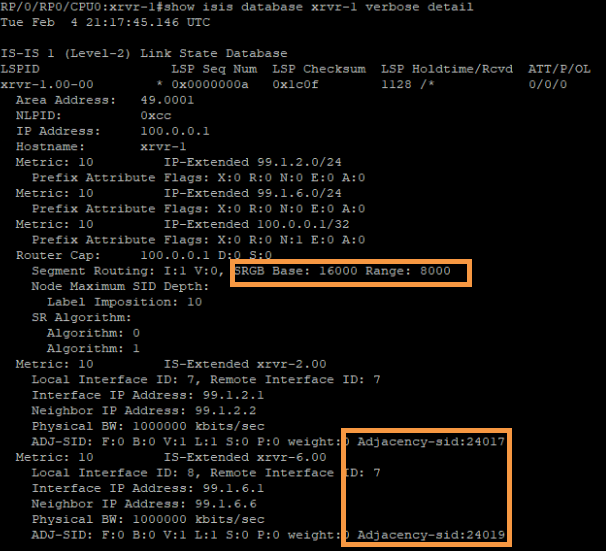

# Task 2: Implement Segment Routing

Step 1:
Enable segment routing on the core routers from xrvr-1 through xrvr-6 by entering the command segment-routing mpls under ISIS process.

To enable Segment Routing, go to configuration mode (conf t), and then use the alias “b1“. The alias configures the following:
```
configure
 router isis 1
	address-family ipv4 unicast
	segment-routing mpls
	commit
end
```
```
RP/0/0/CPU0:xrvr-1#conf
RP/0/0/CPU0:xrvr-1(config)#router isis 1
RP/0/0/CPU0:xrvr-1(config)#address-family ipv4 unicast
RP/0/0/CPU0:xrvr-1(config)#segment-routing mpls
RP/0/0/CPU0:xrvr-1(config)#commit
```
> Repeat this task
> Repeat this step on the core routers xrvr-1 to xrvr-6 to configure segment routing.×Dismiss this alert.

Step 2:
Verify if Segment Routing is working and labels assigned per SR by using the command "show isis database xrvr-1 verbose detail" and "show mpls label table":




> Repeat this task
> Follow the above step in the core routers xrvr-1 through xrvr-6 to confirm Segment routing assigned labels. The label 16000 assigned should confirm SR is working.


Step 3:
The Segment Routing Global Block’s (SRGB) default range is from 16000 to 23999 (No configuration needed).

Step 4:
The SRGB can be manually changed. In this lab the SRGB is to be set in the range of 19000 to 20999 (2000 labels).

Step 5:
Configure the SRGB manually on the routers from xrvr-1,xrvr-2,xrvr-3,xrvr-4,xrvr-5 and xrvr-6 as shown below:

```
configure
 segment-routing
  global-block 19000 20999
 commit
end
```
Step 6:
Confirm the SRGB has taken effect check as shown below (by using aliases “b5” and “b6”):


> ATTENTION
> The label 19000 confirms that SRGB has changed from default to manual (19000 - 20999)×Dismiss this alert.
Follow Step-8 below by configuring the Prefix-SID of the loopbacks on the routers from xrvr-1 to xrvr-6 as given in the below table:

Step 8:
Follow the below CLI to assign prefix SID to the loopbacks on the routers from xrvr-1 to xrvr-6

```

configure
 router isis 1
  interface loopback 0
   address-family ipv4 unicast
   prefix-sid absolute 19001
 commit
end
```

> INFORMATION
> The prefix-sid values to the nodes can also be given by using the other command “prefix-sid index ”×Dismiss this alert.
Step 9:
Verify the loopbacks are assigned with the required Prefix SID as shown below:

```
RP/0/0/CPU0:xrvr-1#show isis segment-routing label table
Fri Nov 27 15:06:04.154 UTC

IS-IS 1 IS Label Table
Label         Prefix/Interface
----------    ----------------
19001         Loopback0
19002         100.0.0.2/32
19003         100.0.0.3/32
19004         100.0.0.4/32
19005         100.0.0.5/32
19006         100.0.0.6/32
```
> Repeat Step-9 (optional)
> Repeat this command on all nodes to view the prefix sid×Dismiss this alert.
Step 10:
Now if we check the trace from xrvr-7 to the loopback of xrvr-8, it still shows LDP is preferred over Segment Routing, and that is fine, as expected. Next we will migrate from LDP to SR.
```
RP/0/0/CPU0:xrxr-7#traceroute 100.0.0.8
Fri Nov 27 15:06:38.269 UTC

Type escape sequence to abort.
Tracing the route to 100.0.0.8

 1  99.1.7.1 9 msec  0 msec  0 msec
 2  99.1.6.6 [MPLS: Labels 24007/24014 Exp 0] 9 msec  9 msec  9 msec
 3  99.5.6.5 [MPLS: Labels 24004/24014 Exp 0] 9 msec  9 msec  9 msec
 4  99.4.5.4 [MPLS: Label 24014 Exp 0] 19 msec  9 msec  9 msec
 5  99.4.8.8 19 msec  *  9 msec
```
