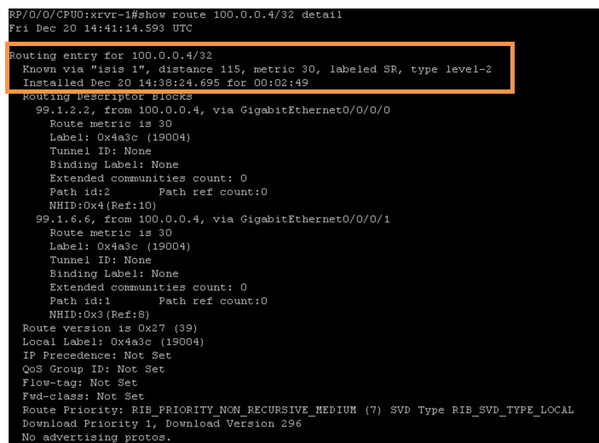
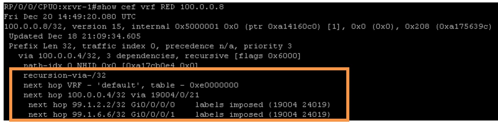
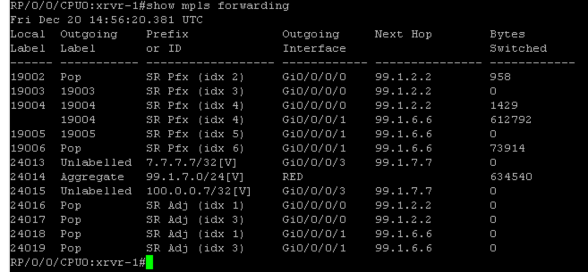

# Task 3: Migrating from LDP to Segment routing

Step 1:
In order to prefer Segment Routing over LDP, following commands needs to be configured on the routers from xrvr-1 to xrvr-6.

```
configure
 router isis 1
  address-family ipv4 unicast
   segment-routing mpls sr-prefer
commit
end
```

> Repeat Step-1 (Mandatory)
> Repeat this step on xrvr-1, xrvr-2, xrvr-3, xrvr-4, xrvr-5 and xrvr-6 to prefer SR.

Step 2:
Now to verify if Segment Routing is preferred, traceroute from xrvr-7 to xrvr-8 or vice versa can be used.
```
RP/0/0/CPU0:xrxr-7#traceroute 100.0.0.8
Fri Nov 27 15:20:25.352 UTC

Type escape sequence to abort.
Tracing the route to 100.0.0.8

 1  99.1.7.1 9 msec  0 msec  0 msec
 2  99.1.6.6 [MPLS: Labels 19004/24014 Exp 0] 9 msec  9 msec  9 msec
 3  99.5.6.5 [MPLS: Labels 19004/24014 Exp 0] 9 msec  9 msec  9 msec
 4  99.4.5.4 [MPLS: Label 24014 Exp 0] 9 msec  9 msec  19 msec
 5  99.4.8.8 19 msec  *  9 mse
```

* Check the label numbers in hops 2 – 4, they have changed to the prefix sid assigned to the loopback of xrvr-4 (19004).
* The label 24014 (might be different in your LAB) is the vpn label and the label 19004 is the prefix-sid of xrvr-4.


Step 3:
At this point in the lab, the core routers xrvr-1 through xrvr-6 are configured with both LDP and SR, and now SR is preferred. We have migrated the core from LDP to SR. Check with the "show isis route 100.0.0.4/32 detail" and "show ip route 100.0.0.4/32 detail" on xrvr-1.

```
RP/0/0/CPU0:xrvr-1#show isis route 100.0.0.4/32 detail
Fri Nov 27 15:22:50.436 UTC

L2 100.0.0.4/32 [30/115] medium priority
     via 99.1.6.6, GigabitEthernet0/0/0/1, xrvr-6, SRGB Base: 19000, Weight: 0
     via 99.1.2.2, GigabitEthernet0/0/0/0, xrvr-2, SRGB Base: 19000, Weight: 0
     src xrvr-4.00-00, 100.0.0.4, prefix-SID index 4, R:0 N:1 P:0 E:0 V:0 L:0
```
The output above clearly shows the Prefix-SID (index 4 = “19004“) of Loopback0 Interface of xrvr-4 (PE router).


> INFORMATION
> The above commands show that ecmp is present when doing segment routing, and it confirms that the labels are based on SR.

Step 4:
Check the cef entry of route 100.0.0.8/32 on xrvr-1 by using "show cef vrf RED 100.0.0.8/32":



Step 5:
After verifying that the control plane is using Segment Routing, we can remove LDP from the core.

Step 6:
Remove the MPLS LDP from the routers xrvr-1 through xrvr-6 by using the configuration below:

```
configure
	no mpls ldp
 	commit
 end
```

Step 7:
Verify if there is any configuration of mpls.

```
RP/0/0/CPU0:xrvr-1#show running-config mpls
Fri Nov 27 15:28:00.764 UTC
% No such configuration item(s)

RP/0/0/CPU0:xrvr-1#c8
RP/0/0/CPU0:xrvr-1#show running-config mpls traffic-eng
Fri Nov 27 15:28:15.313 UTC
% No such configuration item(s)
```

# Verify Segment Routing Forwarding
Step 1:
On xrvr-1, verify the various MPLS forwarding entries programmed by issuing the command "show mpls forwarding" as below:



* By default, Penultimate Hop Popping (PHP) is enabled. For example, for neighbor xrvr-2’s prefix-SID (19002) the label is Pop, as seen above
* Prefix SIDs are ECMP aware, e.g. the ipv4 prefix-SID to xrvr-4 (19004), has two outgoing labels, as seen above. One towards xrvr-2 and one towards xrvr-6.
  
> Repeat this task (optional)
> Repeat this step on xrvr-2 through xrvr-6 to view MPLS forwarding entries.
