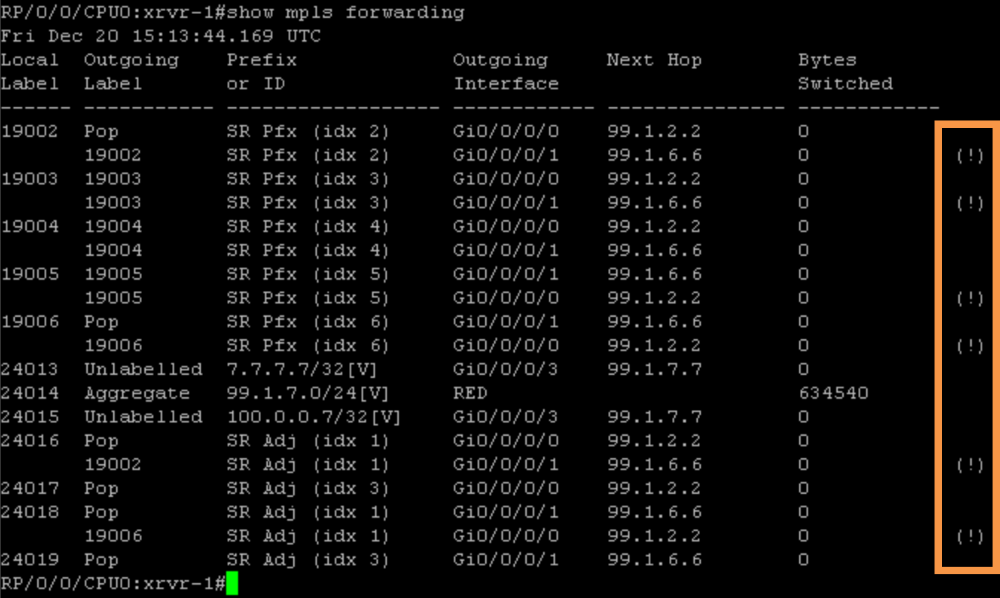

# Task 4: Implement TI-LFA

This scenario demonstrates the configuration of TI-LFA link protection and the verification of the TI-LFA backup path based on the original topology.

1.  Verify the adjacency-SIDs of xrvr-1 for the adjacency to xrvr–2:

```
RP/0/0/CPUO:xrvr-1#show isis adjacency systemid xrvr-2 detail
Fri Dec 20 15:26:41.646 UTC

IS-IS 1 Level-2 adjacencies:
System Id Interface SNPA State Hold Changed NSF IPv4 IPv6
xrvr-2 Gi0/000 *Ptop+ Up BFD BFD 28 4d17h Yes None None

Area Address:49.0001
Neighbor IPv4 address: 99.1.2.2*
Adjacency SID: 24014
Non-FRR Adjacency SID: 24015
Topology: IPv4 Unicast

Total adjacency count: 1
```
> NOTE:
> Protected and Unprotected adjacency-SIDs are allocated for IPv4 address family, but the protected adjacency-SIDs are not actually protected because TI-LFA is not enabled yet. Protected adjacency-SIDs with active protection are marked with the indication (protected).×Dismiss this alert.

2. Enable TI-LFA by applying the following configuration on xrvr-1. This configuration enables TI-LFA on all ISIS interfaces.
```
configure terminal
router isis 1
interface GigabitEthernet0/0/0/0
 address-family ipv4 unicast
  fast-reroute per-prefix
  fast-reroute per-prefix ti-lfa
  exit
 exit
interface GigabitEthernet0/0/0/1
 address-family ipv4 unicast
  fast-reroute per-prefix
  fast-reroute per-prefix ti-lfa
  exit
 exit
commit
```

3. Verify the repair path on xrvr-1 for xrvr-4. Notice that the output of the show isis fast-reroute command displays the backup path for 100.0.0.4/32 as FRR backup. Traffic is steered towards xrvr-2 (Gi0/0/0/0).

First we confirm that backup paths exist in the table.


> IMPORTANT: the ‘(!)’ at the end of some of the loopback routes.  These are the routes protected by FRR.  These routes are installed in the FIB as a backup route in the event the primary path fails.  With these backup routes, the router does not need to wait for ISIS to reconverge before forwarding packets again.


<br><br><br>
> IMPORTANT: The scenario below would occur only if there is a difference in the ISIS link cost on both paths towards the destination.

```
RP/0/0/CPUO:xrvr-1# show isis fast-reroute 100.0.0.4/32 detail
Fri Dec 20 15:29:41.646 UTC

L2 100.0.0.4/32 [30/115] medium priority
  via 99.1.6.6, Gigabit Ethernet0/0/0/1, xrvr-6, SRGB Base: 19000, Weight: 0
   FRR backup via 99.1.2.2, Gigabit Ethernet0/0/0/0, xrvr-2, SRGB Base: 19000, Weight: 0, Metric: 30
   P: Yes, TM: 30, LC: No, NP: Yes, D: Yes, SRLG: Yes
  via 99.1.2.2, Gigabit Ethernet0/0/0/0, xrvr-2, SRGB Base: 19000, Weight: 0
   FRR backup via 99.1.6.6, Gigabit Ethernet0/0/0/1, xrvr-6, SRGB Base: 19000, Weight: 0, Metric: 30
   P: Yes, TM: 30, LC: No, NP: Yes, D: Yes, SRLG: Yes
  src xrvr-4.00-00, 100.0.0.4, prefix-SID index 4, R:0 N:1 P:0 E:0 V:0 1:0
```

> NOTE:
> TI-LFA computes backup paths for all destinations. TI-LFA computation on xrvr-1 for destination xrvr-4 results in a zero-segment backup path, a backup path that does not require additional segments to be pushed on protected packets. TI-LFA calculates that the post-convergence path to xrvr-4, for a failure of the link to xrvr-6, it goes via xrvr-2. Xrvr-2 provides a loop-free path to destination xrvr-4. No additional labels must be imposed on the packets steered on the backup path, xrvr-1 simply forwards them via xrvr-2×Dismiss this alert.

4. Verify the backup path in RIB. RIB contains the primary path (Protected) and backup path (Backup) by using "show route 100.0.0.4/32 detail"

```
RP/0/0/CPUO:xrvr-1#show route 100.0.0.4/32 detail
Fri Dec 20 15:33:31.136 UTC

Routing entry for 100.0.0.4/32
 Known via "isis 1", distance 115, metric 30, labeled Sr, type level-2
 Installed Apr 22 08:16:30.990 for 00:01:10
 Routing Descriptor Blocks
  99.1.2.2, from 100.0.0.4, via GigabitEthernet0/0/0/0, Protected, Backup (Local-LFA)
   Route metric is 30
   Label: Ox4a3c (19004)
   Tunnel ID: None
   Binding Label: None
   Extended communities count: 0
   Path id:2 Path ref count:1
   NHID: 0x2 (Ref:13)
   Backup path id:1
  99.1.6.6, from 100.0.0.4, via Gigabit Ethernet0/0/0/1, Protected, Backup (Local-LFA)
   Route metric is 30
   Label: Ox4a3c (19004)
   Tunnel ID: None
   Binding Label: None
   Extended communities count: 0
   Path id:1 Path ref count: 1
   NHID: 0x3 (Ref:13)
   Backup path id:2
Route version is Oxf (15)
Local Label: Ox4a3c (19004)
IP Precedence: Not Set
QoS Group ID: Not Set
Flow-tag: Not Set
Fwd-class: Not Set
Route Priority: RIB_PRIORITY NON RECURSIVE_MEDIUM (7) SVD Type RIB SVD TYPE LOCAL
Download Priority 1, Download Version 78
No advertising protos.
```
5. Verify the backup path in FIB. Notice the CEF contains the primary (Protected) and backup path (Backup) by using "sh cef 100.0.0.4/32“.
```
RP/0/0/CPUO:xrvr-1#sh cef 100.0.0.4/32
Fri Dec 20 15:35:11.222 UTC
100.0.0.4/32, version 76, labeled SR, internal 0x1000001 0x83 (ptr Oxa13f2174) [1], Oxo (Oxa13d7b00), Oxa28 (Oxa17c907c)
 Updated Apr 14 08:25:49.022
 local adjacency 99.1.2.2
 Prefix Len 32, traffic index 0, precedence n/a, priority 1
 Extensions: context-label:19004
  via 99.1.2.2/32, Gigabit Ethernet0/0/0/0, 9 dependencies, veight o, class 0, protected, backup (Local-LF.) [flags 0x600] path-idx O bkup-idx 1 NHID OXO [Oxa177b1fc Ox0] next hop 99.1.2.2/32 local label 19004 labels imposed (19004)
  via 99.1.6.6/32, Gigabit Ethernet0/0/0/1, 9 dependencies, weight 0, class o, protected, backup (Local-LF) [flags Ox600] path-idx i bkup-idx O NHID OXO (Oxa177b42c OxO) next hop 99.1.6.6/32 local label 19004 labels imposed (19004)
```
6. Verify adjacency segment protection by using "show isis adjacency systemid xrvr-2 detail“.
```
RP/0/0/CPUO:xrvr-1#show isis adjacency systemid xrvr-2 detail
Fri Dec 20 15:36:24.525 UTC

IS-IS 1 Level-2 adjacencies:
System Id Interface SNPA State Hold Changed NSF IPv4 IPv6
                                                BFD BFD
xrvr-2 Gi0/00/0 *PtoP* Up 29 4d17h Yes None None

 Area Address: 49.0001
 Neighbor IPv4 address: 99.1.2.2*
 Adjacency SID: 24014 (protected)
  Backup label stack: [19002]
  Backup stack size: 1
  Backup interface: Gi0/0/0/1
  Backup nexthop: 99.1.6.6
  Backup node address: 100.0.0.2
 Non-FRR Adjacency SID: 24015
 Topology: IPv4 Unicast

Total adjacency count: 1
```
By enabling TI-LFA on a link, the adjacency-SIDs of that link are also protected. Only the protected adjacency-SID is protected; the non-protected or non-FRR adjacency-SIDs stays unprotected. The backup path for an adjacency-SID steers the traffic to the remote end of the link.

7. Enable TI-LFA on xrvr2-6

Devices xrvr-1 and xrvr-4 should have the following configuration
```
router isis 1
interface GigabitEthernet0/0/0/0
 address-family ipv4 unicast
  no fast-reroute per-prefix
  no fast-reroute per-prefix ti-lfa
  exit
 exit
interface GigabitEthernet0/0/0/1
 address-family ipv4 unicast
  no fast-reroute per-prefix
  no fast-reroute per-prefix ti-lfa
  exit
 exit
commit
```
Devices xrvr-2 & 3 and xrvr-5 & 6 should have the following configuration
```
router isis 1
interface GigabitEthernet0/0/0/0
 address-family ipv4 unicast
  no fast-reroute per-prefix
  no fast-reroute per-prefix ti-lfa
  exit
 exit
interface GigabitEthernet0/0/0/1
 address-family ipv4 unicast
  no fast-reroute per-prefix
  no fast-reroute per-prefix ti-lfa
  exit
 exit
interface GigabitEthernet0/0/0/2
 address-family ipv4 unicast
  no fast-reroute per-prefix
  no fast-reroute per-prefix ti-lfa
  exit
 exit
commit
```
