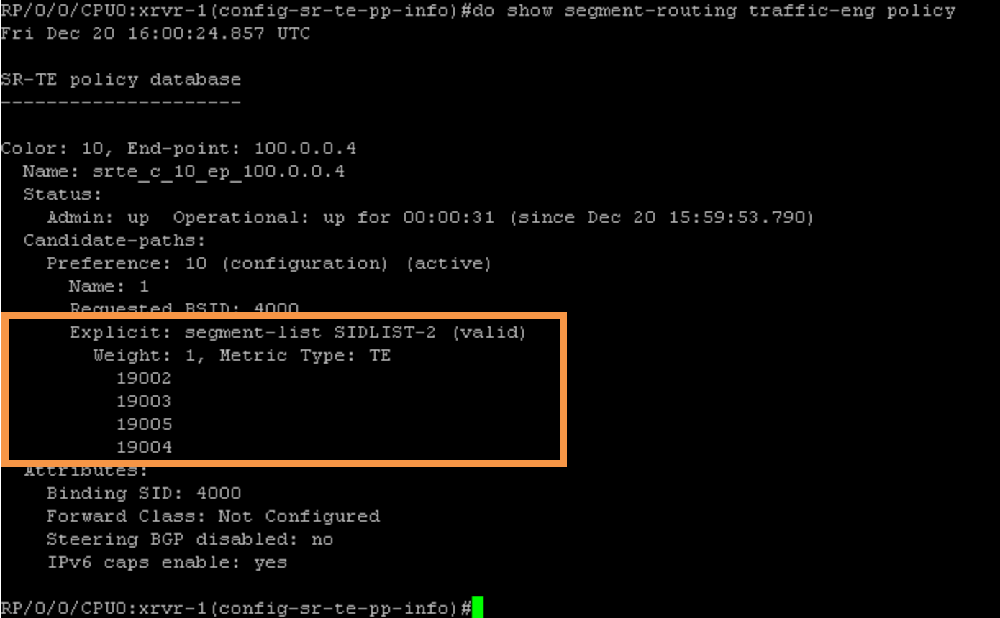
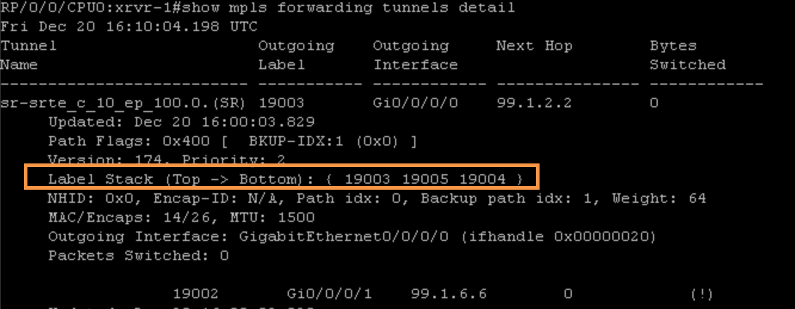
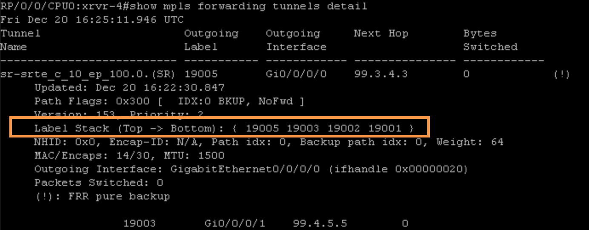
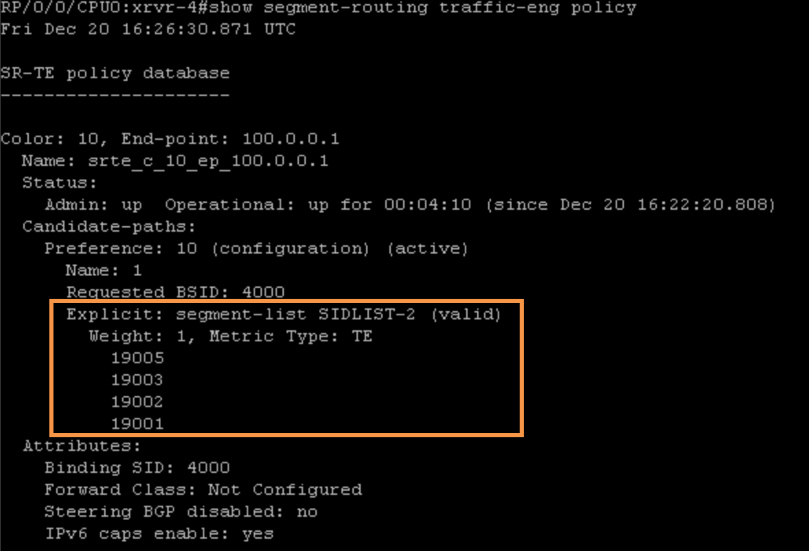

# Task 6: Implement Segment Routing Traffic Engineering (SR-TE) using SR-Policy

This scenario demonstrates how to configure SR-TE Policies in an explicit way.

> WARNING
> Please enable Traffic Engineering process under ISIS on: xrvr-1, xrvr-2, xrvr-3, xrvr-4, xrvr-5 and xrvr-6 as shown below:×Dismiss this alert.

```
configure
  router isis 1
	address-family ipv4 unicast
	mpls traffic-eng level-2-only
	mpls traffic-eng router-id loopback0
	root
  mpls traffic-eng
commit
end
```

Step 1:  On xrvr-1, enter the following commands to configure the explicit path. The explicit path expresses the SIDLIST-2 of the SR policy path.
```
configure
 segment-routing traffic-eng
  segment-list name SIDLIST-2
   index 10 mpls label 19002
   index 20 mpls label 19003
   index 30 mpls label 19005
   index 40 mpls label 19004
 commit
```
Step 2:  Enter the following commands to configure the SR policy named “1”. The SR policy is identified by its end-point (100.0.0.4, in this example) and its color (10, in this example). By default, a dynamic Binding-SID label is allocated for an SR policy, but in this example, an explicit Binding-SID label 4000 is configured. Multiple paths can be configured, each with its preference value. The valid path with the highest preference value is selected as the path of the SR policy. The explicit-path SIDLIST-2 is specified as path of this SR policy.

>
> !! ON XRVR-1 !!
>
>On xrvr-1, configure the following:
```
configure
segment-routing
 traffic-eng
  policy 1
   binding-sid mpls 4000
   color 10 end-point ipv4 100.0.0.4
   candidate-paths
    preference 10
     explicit segment-list SIDLIST-2
     !
 commit
end
```

Step 3:  On xrvr-1, verify the status of the SR policy by using "show segment-routing traffic-eng policy”:


> NOTE: The segment list is as specified in the explicit path.


Step 4:  On xrvr-1, verify the Binding-SID (label 4000) forwarding entry using "show mpls forwarding labels 4000″:
```
RP/0/0/CPUO:xrvr-1#show mpls forwarding labels 4000
Fri Dec 20 16:00:24.857 UTC
Local   Outgoing    Prefix  Outgoing       Next Hop        Bytes
Label   Label       or ID   Interface                   Switched
-----   --------    ------  ---------      --------        --------
4000    Pop         No ID   srte_c_10_ep   point2 point    0
```

Step 5:  On xrvr-1, verify the forwarding entry of the SR policy (‘srte_c_10_ep’) using "show mpls forwarding tunnels″:

```
RP/0/0/CPUO:xrvr-1#show mpls forwarding tunnels
Fri Dec 20 16:02:26.113 UTC
Local               Outgoing    Outgoing    Next Hop        Bytes
Label               Label       Interface                   Switched
-----               --------    ---------   --------        --------
tunnel-te1          (SR) 19003  Gi0/0/0/0    99.1.2.2        0
srte_c_10_ep        (SR) 19003  Gi0/0/0/0    99.1.2.2        0
```
Step 6:  Enter the following command (show mpls forwarding tunnels detail | begin srte) to see details of the imposed Label Stack:



> Note: Let's create now the reverse SR Policy (tunnel) from XRVR-4 towards XRVR-1 as Destination.


Step 7:  On xrvr-4, enter the following commands to configure the explicit path. The explicit path expresses the SIDLIST-2 of the SR policy path.
```
configure
 segment-routing traffic-eng
  segment-list name SIDLIST-2
   index 10 mpls label 19005
   index 20 mpls label 19003
   index 30 mpls label 19002
   index 40 mpls label 19001
 commit
```

Step 8:  On xrvr-4, configure the SR Policy (named “1”), with the corresponding Binding-SID as well as the SIDLIST-2 as the explicit path list.
```
configure
segment-routing
 traffic-eng
  policy 1
   binding-sid mpls 4000
   color 10 end-point ipv4 100.0.0.1
   candidate-paths
    preference 10
     explicit segment-list SIDLIST-2
     !
 commit
end
```




> OPTIONAL STEP 
> Step 9:  If you want to push the customer traffic coming from CE’s inside the SR Policy, you need to shutdown all the other TE Tunnels created on previous tasks and also apply the following additional command (autoroute include ipv4 100.0.0.4/32) on xrvr-1 and (autoroute include ipv4 100.0.0.1/32) xrvr-4 as shown below:


On xrvr-1 configure the following:
```
conf t
segment-routing
 traffic-eng
  policy 1
   autoroute include ipv4 100.0.0.4/32
     !
 commit
end
```
