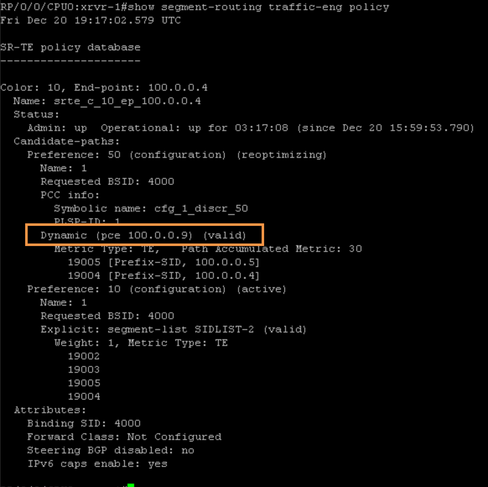
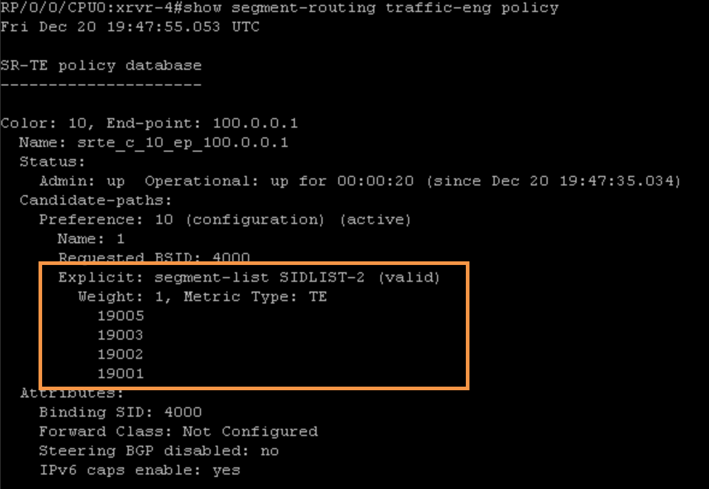
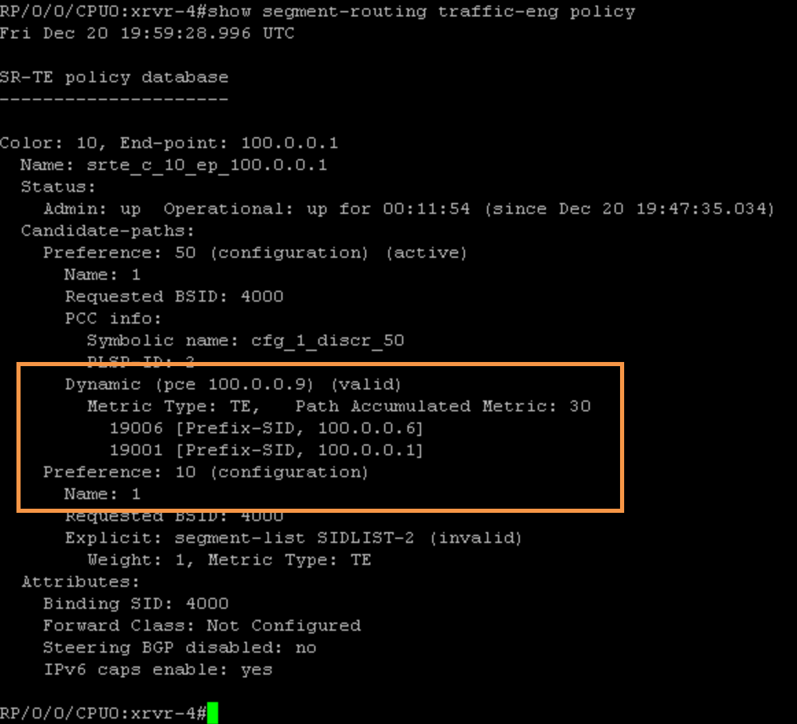
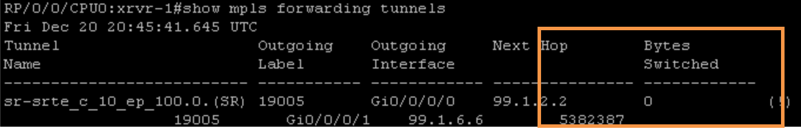

#Task 8: Configure SR Dynamic Path using the Network Controller (SR-PCE)

This scenario demonstrates how to instantiate an SR policy from a locally configured interface tunnel (a.k.a SR Policy). The SR Policy path can be computed locally on the head-end, or the SR-PCE Controller can compute it. In this scenario, SR-PCE computes the path.

Step 1:  On ```xrvr-1```, enter the following commands to instantiate an SR Policy named “Policy 1” and configure the policy to request SR-PCE to compute a path to end-point 100.0.0.4 (xrvr-4). SR-PCE must calculate the best path for the destination (xrvr-4) and provide a List of Segments to ```xrvr-1```. In turn, ```xrvr-1``` will install this List of Segments in CEF for the “Policy 1“.

> Note: Please keep in mind!
The tunnel interfaces te1 and te20 need to be shut down on xrv-1 and xrv-4! You cant have a policy and a tunnel for the same prefix at the same time.

```
segment-routing
traffic-eng
 !
 policy 1
  binding-sid mpls 4000
  color 10 end-point ipv4 100.0.0.4
  autoroute
   include ipv4 100.0.0.4/32
  !
  candidate-paths
exit
   preference 50
    dynamic
     pcep
```
Step 2:  Verify the status of the SR policy on ```xrvr-1``` by using the command (```“show segment-routing traffic-eng policy```”) as shown below. Also make sure the Path is dynamically calculated by the PCE:


> Note: ```xrvr-1``` used PCEP PCRequest and PCReply messages to request and receive the path computation. Then ```xrvr-1``` sent a PCReport message to report the SR Policy to ```xrvr-9``` node. In the report to its SR-PCE, ```xrvr-1``` sets the delegate (D) flag, to indicate that SR-PCE can update the path.

Step 3:  Enter the following command (“```show pce lsp detail```”) on SR-PCE to show the SR policy information that we created on ```xrvr-1``` (PCC – 100.0.0.1):
```
RP/0/0/CPU0:xrvr-9#show pce lsp detail
Fri Dec 20 19:19:44.239 UTC

PCE's tunnel database:
----------------------
PCC 100.0.0.1:

Tunnel Name: cfg_1_discr_50
Color: 10
Interface Name: srte_c_10_ep_100.0.0.4
 LSPs:
  LSP[0]:
   source 100.0.0.1, destination 100.0.0.4, tunnel ID 1, LSP ID 1
   State: Admin up, Operation up
   Setup type: Segment Routing
   Binding SID: 4000
   Maximum SID Depth: 10
   Absolute Metric Margin: 0
   Relative Metric Margin: 0%
   Preference: 50
   Bandwidth: requested 0 kbps, applied 0 kbps
   PCEP information:
     PLSP-ID 0x1, flags: D:1 S:0 R:0 A:1 O:1 C:0
   LSP Role: Single LSP
   State-sync PCE: None
   PCC: 100.0.0.1
   LSP is subdelegated to: None
   Reported path:
     Metric type: TE, Accumulated Metric 30
      SID[0]: Node, Label 19005, Address 100.0.0.5
      SID[1]: Node, Label 19004, Address 100.0.0.4
   Computed path: (Local PCE)
     Computed Time: Fri Dec 20 19:16:51 UTC 2024 (00:02:53 ago)
     Metric type: TE, Accumulated Metric 30
      SID[0]: Node, Label 19005, Address 100.0.0.5
      SID[1]: Node, Label 19004, Address 100.0.0.4
   Recorded path:
     None
   Disjoint Group Information:
     None

RP/0/0/CPU0:xrvr-9#
```
> Repeat
Repeat the step on router ```xrvr-4``` in order to have the reverse path tunnel, as per Step 4 below.

Prior to making the change, lets confirm what the status of the SR Policy



Step 4:  On ```xrvr-4```, enter the following commands to instantiate an SR policy named “```Policy 1```” and configure the policy to request SR-PCE to compute a path to end-point 100.0.0.1 (```xrvr-1```). SR-PCE must calculate the best path for the destination (```xrvr-1```) and provide a List of Segments to ```xrvr-4```. In turn, ```xrvr-4``` will install this List of Segments in CEF table for the “```Policy 1```“.
```
segment-routing
 traffic-eng
  !
  policy 1
   binding-sid mpls 4000
   color 10 end-point ipv4 100.0.0.1
   autoroute
    include ipv4 100.0.0.1/32
   !
   candidate-paths
    preference 50
     dynamic
      pcep
```
Step 5:  Verify the status of the SR policy on ```xrvr-4``` by using the command (“```show segment-routing traffic-eng policy```”) as shown below. Also make sure the Path is dynamically calculated by the PCE:


Step 6:  Enter the following command (“```show pce lsp detail```”) on SR-PCE to show the SR policy information that we created on ```xrvr-4``` (PCC – 100.0.0.4):
```
RP/0/0/CPU0:xrvr-9#show pce lsp detail
Fri Dec 20 20:37:33.259 UTC

PCE's tunnel database:
----------------------
PCC 100.0.0.1:

Tunnel Name: cfg_1_discr_50
Color: 10
Interface Name: srte_c_10_ep_100.0.0.4
 LSPs:
  LSP[0]:
   source 100.0.0.1, destination 100.0.0.4, tunnel ID 1, LSP ID 2
   State: Admin up, Operation up
   Setup type: Segment Routing
   Binding SID: 4000
   Maximum SID Depth: 10
   Absolute Metric Margin: 0
   Relative Metric Margin: 0%
   Preference: 50
   Bandwidth: requested 0 kbps, applied 0 kbps
   PCEP information:
     PLSP-ID 0x1, flags: D:1 S:0 R:0 A:1 O:1 C:0
   LSP Role: Single LSP
   State-sync PCE: None
   PCC: 100.0.0.1
   LSP is subdelegated to: None
   Reported path:
     Metric type: TE, Accumulated Metric 30
      SID[0]: Node, Label 19005, Address 100.0.0.5
      SID[1]: Node, Label 19004, Address 100.0.0.4
   Computed path: (Local PCE)
     Computed Time: Fri Dec 20 20:36:28 UTC 2024 (00:01:05 ago)
     Metric type: TE, Accumulated Metric 30
      SID[0]: Node, Label 19005, Address 100.0.0.5
      SID[1]: Node, Label 19004, Address 100.0.0.4
   Recorded path:
     None
   Disjoint Group Information:
     None

PCC 100.0.0.4:

Tunnel Name: cfg_1_discr_50
Color: 10
Interface Name: srte_c_10_ep_100.0.0.1
 LSPs:
  LSP[0]:
   source 100.0.0.4, destination 100.0.0.1, tunnel ID 1, LSP ID 2
   State: Admin up, Operation up
   Setup type: Segment Routing
   Binding SID: 4000
   Maximum SID Depth: 10
   Absolute Metric Margin: 0
   Relative Metric Margin: 0%
   Preference: 50
   Bandwidth: requested 0 kbps, applied 0 kbps
   PCEP information:
     PLSP-ID 0x2, flags: D:1 S:0 R:0 A:1 O:1 C:0
   LSP Role: Single LSP
   State-sync PCE: None
   PCC: 100.0.0.4
   LSP is subdelegated to: None
   Reported path:
     Metric type: TE, Accumulated Metric 30
      SID[0]: Node, Label 19006, Address 100.0.0.6
      SID[1]: Node, Label 19001, Address 100.0.0.1
   Computed path: (Local PCE)
     Computed Time: Fri Dec 20 20:36:28 UTC 2024 (00:01:05 ago)
     Metric type: TE, Accumulated Metric 30
      SID[0]: Node, Label 19006, Address 100.0.0.6
      SID[1]: Node, Label 19001, Address 100.0.0.1
   Recorded path:
     None
   Disjoint Group Information:
     None

```
Step 7:  In this step, we will verify end-to-end connectivity from ```xrvr-7``` to ```xrvr-8```, in order to make sure the traffic is passing through the SR Policies created earlier. But, before we do that, let’s verify if there is any Data / Packet flow going via the SR Policy on ```xrvr-1```:


As can be seen from the picture above, currently there is no Bytes Switched via the SR Policy. In your case it might be greater than “0” due to other testings performed earlier. That’s ok.

Step 8:  On ```xrvr-7```, execute the Ping and Traceroute command towards the Loopback IP-address of ```xrvr-8```, in order to make sure there is reachability end-to-end:
```
xrvr-7#ping 100.0.0.8
Type escape sequence to abort.
Sending 5, 100-byte ICMP Echos to 100.0.0.8, timeout is 2 seconds:
!!!!!
Success rate is 100 percent (5/5), round-trip min/avg/max = 15/16/18 ms
```
```
RP/0/0/CPU0:xrxr-7#traceroute 100.0.0.8

Type escape sequence to abort.
Tracing the route to 100.0.0.8

 1  99.1.7.1 9 msec  0 msec  0 msec
 2  99.1.6.6 [MPLS: Labels 19005/19004/24014 Exp 0] 19 msec  19 msec  19 msec
 3  99.5.6.5 [MPLS: Labels 19004/24014 Exp 0] 29 msec  39 msec  29 msec
 4  99.4.5.4 [MPLS: Label 24014 Exp 0] 19 msec  19 msec  19 msec
 5  99.4.8.8 29 msec  *  19 msec
```
Step 9:  The final step is to verify if Data/Packet flow is pushed through the SR Policy on ```xrvr-1```:



Our GitHub code is available here here: https://github.com/beye91/LTRMPL-2208
