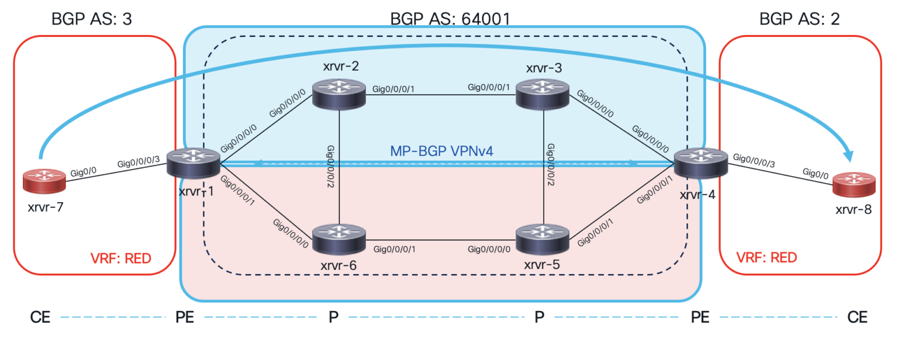

# Task 9: SR-TE with Flex-Algo, Automated Steering (AS) and On-demand Next-hop (ODN)

This scenario demonstrates advanced use-cases with SR-TE, that is, Flex-Algo. Flex-Algo is used for Network Slicing, think of Multi-planar Network, where the Red plane serves specific traffic and Blue plane other type of traffic. 
If a node advertises participation in Flex-Algo, likely it advertises a Prefix-SID for that Flex-Algo
<center>
</center>

<br>
Configure Flex-Algo
Step 1:  Based on the Topology below, let’s configure Flex-Algo in Multi-Plane mode, Blue (Algo 128) and Red (Algo 129) in the core routers: 


On ```xrvr-1```, under ISIS routing instance, configure the Flex-Algo the router belongs to and the Prefix-SID (Algo SID) as per below: 
```
router isis 1
flex-algo 128
   advertise-definition
 !
flex-algo 129
   advertise-definition
 !
interface Loopback0
   passive
   address-family ipv4 unicast
       prefix-sid algorithm 128 absolute 19501
       prefix-sid algorithm 129 absolute 19601
```
On ```xrvr-4```, under ISIS routing instance, configure the Flex-Algo the router belongs to and the Prefix-SID (Algo SID) as per below: 

```
router isis 1
 flex-algo 128
    advertise-definition
  !
 flex-algo 129
    advertise-definition
  !
 interface Loopback0
    passive
    address-family ipv4 unicast
        prefix-sid algorithm 128 absolute 19504
        prefix-sid algorithm 129 absolute 19604

```
Step 2:  Now let’s configure “Algo 128” on xrvr-2, Blue plane (Algo 128) as per example below:
```
router isis 1
 flex-algo 128
    advertise-definition
  !
 interface Loopback0
    passive
    address-family ipv4 unicast
        prefix-sid algorithm 128 absolute 19502
```
Step 3:  Here is a challenge for YOU. Now that you understand Flex-Algo config, let’s enable Flex-algo on xrvr-3 (hint: check above example from xrvr-2 and change the Prefix-SID so that they are unique in the domain):


Step 4:  Challenge continues… do the same for xrvr-5 and xrvr-6, and make sure for the Red plane (flex-algo 129) you use the ‘1960X‘ Prefix-SID, where ‘x’ represents the router number (5 and 6 in this case):

Step 5:  Now that you configured Flex-Algo on all routers, let’s make sure we can see those Prefix-SID specific to Flex-algo. On ‘```xrvr-1```’ check the MPLS forwarding table as below, and make sure you see your Prefix-SID as highlighted below:


Step 6:  Alright, we have done quite some progress, now what’s left is to Push the Data Traffic to a SR-Policy by using the Blue plane only, and avoiding Red plane. This can be achieved as following. On ```‘xrvr-1```‘ configure the SR-Policy as below:
```
segment-routing
 traffic-eng
    segment-list FLEX-SID
        index 10 mpls label 19504
 !
 policy 1
  candidate-paths
    preference 190
        explicit segment-list FLEX-SID
```
Next, as seen below, verify (```‘show segment-routing traffic-eng policy‘```) if SR-Policy uses the Blue Plane path (```xrvr-1``` -> xrvr-2 -> xrvr-3 -> ```xrvr-4```) based on a single Prefix-SID (19504) which is part of Flex-Algo “129” configured earlier.


Step 7:  Finally, let’s try end-to-end (```xrvr-7``` to ```xrvr-8```) connectivity with trace route in order to check whether we are using the Blue Plane as described above:


Look at that result, beautiful.. Remember, the Prefix-SIDs starting with ‘1950X’ are part of the Blue plane. In the output above we can see Prefix-SID ‘19504’ which belongs to ‘```xrvr-4```’ (the destination PE).

This also proves that by using Flex-Algo, a Network Operator can dramatically reduce the number of Prefix-SIDs (labels) pushed into the label stack on PE’s. So only one label is needed to push traffic through a specific plane.

Configure Automated Steering (AS)
BGP can automatically steer traffic into an SR Policy based on BGP next-hop and color of a route. Color of a route is specified by its color extended community attribute. Color extended community is assigned to BGP prefixes (customer routes).

We will assign a color extended community to customer prefix (100.0.0.8/32) on ```xrvr-4```, and advertise the same prefix with BGP color community to ```xrvr-1```. On ```xrvr-1```, we will create a new SR-Policy with the same color number as the BGP color extended community that was assigned to ‘100.0.0.8/32’ by the other PE node. Based on that, traffic destined to the customer prefix mentioned above will be steered through the SR-Policy.

Step 1:  First, let’s assign a color to the customer prefix ‘100.0.0.8/32’. On ```xrvr-4```, apply the following configuration as below:
```
extcommunity-set opaque GREEN
  35
end-set
!
route-policy SET_COLOR
  if destination in (100.0.0.8/32) then
    set extcommunity color GREEN
  else
    pass
  endif
end-policy
!
commit
!
```
Step 2:  Now, on ```‘xrvr-4```‘ let’s adjust the BGP configuration. Under address-family VPNv4, we are going to install the route-policy (SET-COLOR) created earlier in the outgoing direction towards ‘```xrvr-1```’.

On ```xrvr-4```, apply the following configuration as below:
```
router bgp 64001
 neighbor 100.0.0.1
  address-family vpnv4 unicast
   route-policy SET_COLOR out
   !
  !
 !
 commit
!
````
Step 3:  To verify that we are receiving ‘100.0.0.8/32‘ prefix with color ‘35′, let’s check it on ```xrvr-1``` as following:


Step 4:  In this step, we are going back to ‘```xrvr-1```’ in order to configure an SR-Policy with the same color ‘35‘ as the BGP prefix ‘100.0.0.8/32‘. To make it more interesting, let’s also configure an explicit path just for this prefix. This explicit path, goes as following, ```xrvr-1``` -> xrvr-2 -> xrvr-6 -> xrvr-5 -> ```xrvr-4```:
```
segment-routing
 traffic-eng
 !
 segment-list automated_steering
  index 10 mpls label 19002
  index 20 mpls label 19006
  index 30 mpls label 19005
  index 40 mpls label 19004
  !
 !
 policy 35
  binding-sid mpls 5000
  color 35 end-point ipv4 100.0.0.4
  candidate-paths
   preference 10
     explicit segment-list automated_steering
     !
    !
   !
  !
  commit
 !
````
Step 5:  Finally, let’s verify on CE router (```xrvr-7```) that we can reach BGP prefix ‘100.0.0.8/32‘ via the explicit path mentioned above, whereas all other BGP prefix will follow another path:


On-Demand Next Hop (ODN)
BGP can automatically steer traffic into an SR Policy based on BGP next-hop and color of a route. Color of a route is specified by its color extended community attribute. Color extended community is assigned to BGP prefixes (customer routes).

A service head-end (PE router) automatically instantiates an SR Policy to a BGP next-hop when required (on-demand). Color community is used as SLA indicator.
You need to configure an SR Policy template for each color for which on-demand SR Policy instantiation is desired.

An example with two color templates:
– color ’60’ for high bandwidth traffic
– color ’35’ for low-delay traffic

If an SR Policy template exists for color ‘60‘, then a BGP route with color ‘60‘ can trigger an on-demand SR Policy candidate path instantiation to its BGP next-hop (PE).

Step 1:  First, on ```‘‘xrvr-1```‘, let’s remove the old SR-Policy ‘1’, and configure an On-demand SR-policy template. We will assign a color number ’60’ to this template:
```
segment-routing
 traffic-eng
  no policy 1
   !
  !
  on-demand color 60
   dynamic
    pcep
    !
   !
  !
 commit
````
!
Step 2:  Secondly, on ```‘xrvr-4```‘, let’s configure a new route-policy in order to assign the following colors to BGP routes:
– color ‘60‘ for prefix ‘8.8.8.8/32‘
– color ‘35‘ for prefix ‘100.0.0.8/32‘
```
!
extcommunity-set opaque RED
  60
end-set
!
route-policy SET_COLOR_ODN
  if destination in (8.8.8.8/32) then
    set extcommunity color RED
  elseif destination in (100.0.0.8/32) then
    set extcommunity color GREEN
  else
    pass
  endif
end-policy
!
commit
```
!
Step 3:  Next, on ```‘xrvr-4```‘, let’s apply the new route-policy in BGP as following:
```
router bgp 64001
 !
 neighbor 100.0.0.1
  address-family vpnv4 unicast
   no route-policy SET_COLOR out
   route-policy SET_COLOR_ODN out
   commit
  !
 !
end
!
```
Step 4:  Let us check and verify that ```‘‘xrvr-1```‘ is receiving both prefixes with their respective BGP colors as configure earlier:


Step 5:  Next, let us check on ```‘‘xrvr-1```‘ which path the ODN SR-Policy (for ‘8.8.8.8/32′) takes to reach ```‘xrvr-4```‘. Use the following cli command:

```‘show segment-routing traffic-eng policy color 60‘```


As can be seen from the Label values above (19005, 19006), the On-demand Policy we created specifically for prefix ‘8.8.8.8/32’ takes the following path ```‘‘xrvr-1```‘ -> ```‘xrvr-6‘``` -> ‘xrvr-5‘ -> ```‘xrvr-4```‘.

Step 6:  Finally, let us verify the end-to-end path using traceroute on ‘```xrvr-7```‘:


Congratulations, you have successfully finished the SR-TE with Flex-Algo, Automated Steering (AS) and On-demand Next-hop tasks.
